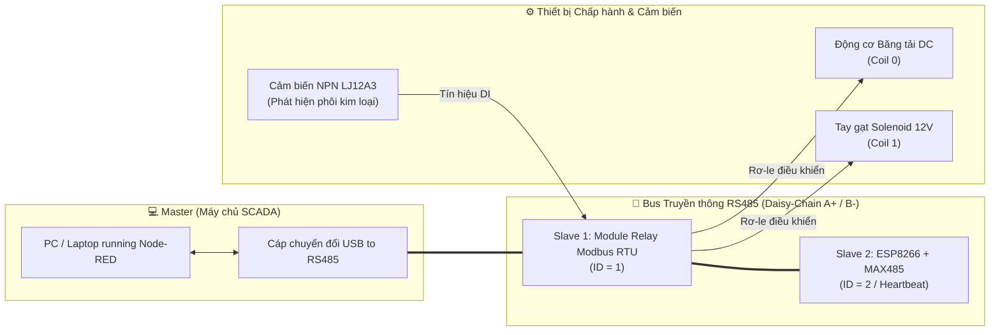

# 🏭 Hệ Thống Phân Loại Kim Loại Tự Động - SCADA Modbus RTU & Node-RED

[](https://nodered.org/)
[-blue)](#)
[](#)
[-orange)](#)

---

## 📋 Giới thiệu dự án

Dự án này là một hệ thống tự động hóa công nghiệp thu nhỏ (**Cyber-Physical System**), ứng dụng giao thức mạng **Modbus RTU** qua chuẩn vật lý **RS485** để giám sát và điều khiển một băng chuyền phân loại sản phẩm thông minh.

Hệ thống có khả năng tự động nhận diện phôi kim loại khi trôi trên băng chuyền, tính toán độ trễ thời gian, và kích hoạt cơ cấu tay gạt (**Solenoid**) để đẩy sản phẩm vào đúng khay chứa. Toàn bộ quá trình vận hành, đếm sản phẩm và giám sát lỗi được quản lý tập trung thông qua một giao diện **HMI/SCADA** thiết kế trực quan trên Node-RED.

---

## 🏗 Cấu trúc hệ thống (System Architecture)

Hệ thống được thiết kế theo cấu trúc mạng **Master-Slave** tiêu chuẩn, với các trạm được kết nối theo kiểu **Daisy-Chain** (mắc nối tiếp) trên cùng một đường bus truyền thông RS485:



* **Master (Máy chủ SCADA):** Máy tính chạy nền tảng Node-RED, thực hiện vòng lặp lấy mẫu (*polling cycle*) liên tục để thu thập dữ liệu và xuất lệnh điều khiển. Giao tiếp với mạng vật lý thông qua cáp chuyển đổi **USB to RS485**.
* **Slave 1 (Node Chấp hành - ID = 1):** Module Relay Modbus RTU. Chịu trách nhiệm trực tiếp giao tiếp với cảm biến tiệm cận và đóng/ngắt các rơ-le điều khiển động cơ băng tải cùng xi-lanh gạt.
* **Slave 2 (Node Mở rộng - ID = 2):** Vi điều khiển ESP8266 tích hợp module chuyển đổi MAX485. Đóng vai trò làm trạm tớ thứ 2 trong mạng, dùng để hiển thị dữ liệu cục bộ hoặc làm bộ giám sát nhịp tim (*Heartbeat Watchdog*) bảo vệ an toàn đường truyền mạng.

---

## 🛠 Danh sách phần cứng (Hardware List)

| STT | Thiết bị | Thông số / Mô tả kỹ thuật | Vai trò trong hệ thống |
| :---: | :--- | :--- | :--- |
| **1** | **Cảm biến từ tiệm cận LJ12A3-4-Z/BX** | Loại NPN (Thường mở - NO), nguồn 6–36V DC, khoảng cách phát hiện $< 4\text{ mm}$ | Phát hiện phôi kim loại trên băng tải |
| **2** | **Nam châm điện (Solenoid) JF-0530B** | Điện áp 12V DC, hành trình kéo/đẩy lực hút mạnh | Cơ cấu tay gạt phân loại phôi |
| **3** | **Động cơ DC & Khung băng chuyền** | Động cơ truyền động DC 12V kéo dây đai băng chuyền | Vận chuyển phôi sản phẩm |
| **4** | **Module Relay Modbus RTU (Slave 1)** | Tích hợp cách ly quang (Optocoupler), hỗ trợ DI và Relay Coils | Node chấp hành & thu thập tín hiệu |
| **5** | **Cáp chuyển đổi USB to RS485** | Chipset công nghiệp chống nhiễu, chân A+ và B- | Cầu nối Master xuống bus RS485 |
| **6** | **ESP8266 & Module MAX485 (Slave 2)** | Vi điều khiển Wi-Fi & module TTL to RS485 | Trạm tớ phụ / Heartbeat watchdog |
| **7** | **Nguồn tổ ong / Adapter 12V DC** | 12V DC - 5A | Cấp nguồn chung cho cảm biến, rơ-le, solenoid |
| **8** | **Dây cáp mạng LAN (Cat5e/Cat6)** | Sử dụng các cặp lõi xoắn đôi (Twisted Pair) | Đi dây tín hiệu A+ và B- chống nhiễu |

---

## 💻 Thiết kế phần mềm & Luồng logic

### 1. Luồng điều khiển tự động hóa (Logic Flow)
Thuật toán được lập trình trên nền tảng **Node-RED** sử dụng bộ thư viện chính `node-red-contrib-modbus`:

* **Quét cảm biến (Polling):** Node-RED liên tục gửi lệnh **`FC2: Read Input Status`** (Chu kỳ lấy mẫu $100\text{ ms}$) tới địa chỉ `IN1` của Slave 1 để theo dõi sát sao trạng thái cảm biến.
* **Lọc & Xử lý (Rising Edge Filter):** Khi cảm biến phát hiện kim loại (tín hiệu chuyển từ `false` sang `true`), khối chức năng lọc sườn lên (*Rising Edge Trigger*) sẽ khóa các xung trùng lặp do chu kỳ quét nhanh gây ra.
* **Đồng bộ thời gian (Delay Sync):** Dựa vào tốc độ thực tế của băng chuyền, hệ thống tính toán độ trễ thời gian ($\text{Delay} \approx 1.0\text{ giây}$) để phôi kim loại di chuyển trôi đúng vị trí trước đầu tay gạt.
* **Kích hoạt cơ cấu (Actuation):** Xuất lệnh **`FC5: Force Single Coil`** tới địa chỉ `Coil 1` (Bật Solenoid). Giữ ngâm điện đủ $1.0\text{ giây}$ để đẩy dứt khoát phôi rớt xuống khay kim loại, sau đó ép lệnh `false` để thu tay gạt về vị trí chờ, chống quá nhiệt và bảo vệ cuộn dây Solenoid.

### 2. Giao diện Giám sát SCADA (Dashboard)
Giao diện được xây dựng bằng gói `node-red-dashboard` với phong cách **Cyberpunk Dark Theme** hiện đại, bao gồm các cụm tính năng chính:

* **Công tắc Chuyển đổi Chế độ (`THỰC TẾ` $\longleftrightarrow$ `MÔ PHỎNG`):**
  * *Chế độ Vận hành Thực tế:* Giao diện tinh gọn, khóa/ẩn toàn bộ các nút bấm can thiệp mô phỏng để tránh thao tác nhầm, tập trung hiển thị nút Bật/Tắt, Reset và thông số kỹ thuật.
  * *Chế độ Mô phỏng (Demo):* Kích hoạt lưới nút test ảo (Thả SP Kim loại, Thả SP Phi kim, Kích hoạt van gạt Solenoid) với hiệu ứng sáng viền Cyan Neon khi click.
* **Bảng điều khiển Trung tâm:** Nút nhấn Toggle đa năng Khởi động / Dừng động cơ băng tải (gửi lệnh vào `Coil 0`).
* **Trạng thái Hệ thống (Digital Twin):** Đồ họa SVG động mô phỏng chân thực chuyển động con lăn băng chuyền, tia quét cảm biến IN1, nhịp gạt xi-lanh và phôi di chuyển thời gian thực.
* **Trung tâm dữ liệu (KPIs):** Bộ đếm sản phẩm kim loại (bị gạt), tổng số lượng sản phẩm, và tỷ lệ phân loại thành công (%).
* **Nhật ký sự kiện (Event Log):** Ghi nhận chi tiết từng mốc sự kiện vận hành, hỗ trợ xuất báo cáo file `.csv` trực tiếp trên trình duyệt.

---

## 🔌 Hướng dẫn cài đặt & Chạy thử

### 1. Đấu nối điện (Wiring)
* **Cấp nguồn:** Nối nguồn `12V DC` vào `VCC` và `GND` của module Relay Modbus RTU và cấp nguồn nuôi cho cảm biến tiệm cận.
* **Tín hiệu cảm biến:** Chân tín hiệu (Dây Đen) của cảm biến NPN cắm vào ngõ `IN1`.
  > [!IMPORTANT]
  > Cần nối chập chân **`GNDIN`** với chân **`GND`** trên bo mạch Modbus để khép kín mạch cách ly quang (*Opto-isolator*) cho cảm biến NPN hoạt động chính xác.
* **Đấu nối RS485:** 
  * Nối chân `A+` của cáp USB-RS485 vào `A+` của Slave 1 và `A+` của Slave 2.
  * Nối chân `B-` của cáp USB-RS485 vào `B-` của Slave 1 và `B-` của Slave 2 theo chuỗi nối tiếp (*Daisy-Chain*).

### 2. Cài đặt môi trường Node-RED
Yêu cầu máy tính đã cài đặt sẵn **Node.js** (khuyến nghị phiên bản LTS) và **Node-RED**:

```bash
# Cài đặt Node-RED toàn cục (nếu chưa có)
npm install -g --unsafe-perm node-red

# Khởi động Node-RED
node-red
```

Trong giao diện quản lý Palette của Node-RED (`Manage palette`), cài đặt thêm 2 gói thư viện:
* `node-red-contrib-modbus`
* `node-red-dashboard`

### 3. Khởi chạy & Vận hành
1. Mở trình duyệt và truy cập vào trang lập trình: `http://localhost:1880`.
2. Chọn **Menu (góc trên bên phải) -> Import**, chọn file [`flows.json`](flows.json) trong thư mục dự án này.
3. Nhấp đúp vào node cấu hình **`Modbus-Client`**:
   * Kiểm tra và chỉnh sửa cổng Serial Port (`COMx` trên Windows hoặc `/dev/ttyUSBx` trên Linux) cho khớp với cáp USB-RS485 nhận diện trong *Device Manager*.
   * Tốc độ Baudrate mặc định: `9600`, Data bits: `8`, Stop bits: `1`, Parity: `None`.
4. Nhấn nút **Deploy** màu đỏ ở góc trên bên phải.
5. Truy cập giao diện điều khiển SCADA tại:
   👉 **`http://localhost:1880/ui`**

---

## 🎯 Kết luận

Dự án đã mô phỏng thành công một mô hình hệ thống sản xuất công nghiệp thực tế. Bằng việc kết hợp giao thức truyền thông **Modbus RTU** ổn định, tin cậy cùng sự linh hoạt, trực quan của nền tảng **Node-RED**, hệ thống không chỉ thực hiện chuẩn xác nghiệp vụ phân loại vật lý mà còn cung cấp khả năng giám sát và thu thập dữ liệu (**Data Acquisition - SCADA**) mạnh mẽ, đáp ứng các tiêu chuẩn cốt lõi trong kỷ nguyên **Công nghiệp 4.0**.
